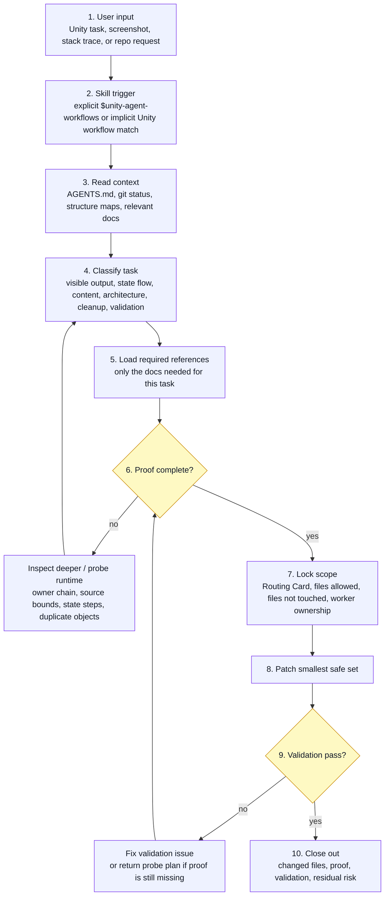

# Unity Game Agent Workflows

[](https://github.com/AUN-PN/unity-agent-workflows/actions/workflows/publish.yml)
[](https://www.npmjs.com/package/unity-agent-workflows)
[](#install-as-a-codex-plugin)

[ภาษาไทย](README.th.md)

Codex plugin, Codex skill, and `npx` installer for AI-assisted Unity 2D game work.

Use it when an agent needs to touch real Unity project files but must first prove the path that actually controls what the player sees: local rules, project structure, scene/prefab references, runtime owner, mutation path, and validation.

| Surface                   | Name                    |
| ------------------------- | ----------------------- |
| npm package               | `unity-agent-workflows` |
| Codex plugin display name | `Unity Workflows`       |
| Skill name                | `unity-agent-workflows` |
| Skill title               | `Unity Agent Workflows` |

The core rule:

```text
No proof, no edit.
```

## Why Use It

Unity agents often fail in the same practical ways: they edit the nearest script, trust scene YAML that gets overwritten in Play Mode, pick the wrong duplicated object name, grow a large controller, or call a change "validated" after only checking syntax.

This plugin gives the agent a stricter workflow for Unity 2D projects:

- read project-local instructions before touching files
- preserve unrelated dirty work
- derive folders, namespaces, assemblies, scenes, prefabs, and content paths from the live repo
- prove runtime-visible owner chains before UI, HUD, scene, prefab, or gameplay edits
- route new C# responsibility to existing project owners instead of broad folders
- keep UI/safe-area/TMP/coordinate-space work tied to the real runtime hierarchy
- load deep reference files only when the current task needs them
- ask before spawning sub-agents unless the user already requested them in the same turn
- validate with the smallest useful check and report residual risk honestly
- require reference proof before cleanup or deletion

`runtime-owner proof` is this project's workflow heuristic, not a Unity API term. It is grounded in Unity's GameObject/Component model, serialized fields, prefab overrides, and runtime instantiation behavior.

## Workflow Steps

The plugin starts from the user's input, routes the task, then loops on proof until it is safe to patch or close out.



Step details:

1. **User input**: a Unity task, screenshot, stack trace, feature request, cleanup request, or validation request enters the agent.
2. **Skill trigger**: the skill runs from an explicit `$unity-agent-workflows` prompt or an implicit Unity 2D repo task that needs editing, validation, routing, runtime proof, state proof, asmdef/module safety, cleanup, or multi-agent coordination.
3. **Read context**: the agent reads `AGENTS.md` if present, `git status --short`, existing `UNITY_STRUCTURE.md` plus only the focused map that matches the task, and only relevant docs.
4. **Classify task**: the request is routed as visible output, state flow, content, architecture, cleanup, or validation.
5. **Load references**: `SKILL.md` selects the required reference files instead of loading every rule. `unity-validation.md` and `workflow-recipes.md` are deferred until validation/recipe context needs them.
6. **Proof loop**: if owner chain, overlay/dim source-bound proof, runtime numeric proof, or guided state-flow proof is missing, the agent loops back to inspect or probe runtime data.
7. **Lock scope**: the main agent names `Files allowed to touch`, `Files explicitly not touched`, and multi-agent ownership before workers patch. Sub-agents are not spawned until the user approves, unless the user already asked for them in the same turn.
8. **Patch**: edit the smallest safe file set only after proof is complete.
9. **Validation loop**: failed validation returns to proof/patch; missing runtime proof returns a probe plan instead of another guess.
10. **Close out**: report changed files, proof, validation, and residual risk.

## Install As A Codex Plugin

In Codex, open Plugins, choose Add marketplace, then use:

```text
Source:
https://github.com/AUN-PN/unity-agent-workflows.git

Git ref:
main

Sparse paths:
```

Leave `Sparse paths` empty.

The Codex marketplace metadata lives at:

```text
.agents/plugins/marketplace.json
.codex-plugin/plugin.json
plugins/unity-agent-workflows/.codex-plugin/plugin.json
plugins/unity-agent-workflows/skills/unity-agent-workflows/SKILL.md
```

After adding the marketplace, install or enable `Unity Workflows` from the Codex Plugins list.

## Install As A Local Skill

Install the skill payload with `npx`:

```bash
npx unity-agent-workflows
```

Install to both Codex and Claude-style skill folders:

```bash
npx unity-agent-workflows --target both
```

Preview without writing files:

```bash
npx unity-agent-workflows --dry-run
```

By default, the installer writes to:

```text
~/.codex/skills/unity-agent-workflows
```

If the target folder already exists, the installer backs it up with a timestamp before replacing it. The `npx` installer installs only the local skill payload; it does not add the Codex plugin marketplace entry.

Supported installer options:

```text
--target codex|claude|both
--codex
--claude
--all, --both
--dest <path>
--dry-run
--no-backup
--help
--version
-h
-v
```

### Optional skills.sh Discovery

The public skill listing can be inspected with:

```bash
npx skills add AUN-PN/unity-agent-workflows --list
```

Install the skill through `skills` for Codex with:

```bash
npx skills add AUN-PN/unity-agent-workflows -a codex -y
```

## Quick Start

Inside a Unity 2D repo, invoke the skill:

```text
$unity-agent-workflows. Teach
```

`Teach` is a Codex skill instruction, not an npm CLI command. Use it when onboarding a new Unity project, when `UNITY_STRUCTURE*` maps are missing or stale, or when the user explicitly requests a structure refresh. When the agent follows it, it creates or refreshes a short structure index and focused maps only where useful:

```text
UNITY_STRUCTURE.md
UNITY_STRUCTURE.ui.md
UNITY_STRUCTURE.runtime.md
UNITY_STRUCTURE.content.md
UNITY_STRUCTURE.assemblies.md
UNITY_STRUCTURE.cleanup.md
```

Because `Teach` writes files, ask for a read-only pass first when you only want analysis:

```text
Use $unity-agent-workflows.
Do not edit yet. Inspect the project structure and report the proposed UNITY_STRUCTURE map plan.
```

Later tasks should read only `UNITY_STRUCTURE.md` plus the focused map that matches the work. They should not run `Teach` again unless a needed map is missing or stale.

| Task                                                                 | Read                                                  |
| -------------------------------------------------------------------- | ----------------------------------------------------- |
| UI, HUD, menu, safe area, TMP, visible target                        | `UNITY_STRUCTURE.md`, `UNITY_STRUCTURE.ui.md`         |
| Runtime behavior, scene objects, interactions, abilities, objectives | `UNITY_STRUCTURE.md`, `UNITY_STRUCTURE.runtime.md`    |
| Balance, localization, ScriptableObjects, config                     | `UNITY_STRUCTURE.md`, `UNITY_STRUCTURE.content.md`    |
| New files, refactor, asmdef, namespace, dependency                   | `UNITY_STRUCTURE.md`, `UNITY_STRUCTURE.assemblies.md` |
| Deletion, cleanup, generated files, Resources/addressables           | `UNITY_STRUCTURE.md`, `UNITY_STRUCTURE.cleanup.md`    |

### Example Case: FTUE Sentinel Install Focus

The visible bug was a repeated FTUE Stage 5 Sentinel install focus mismatch. A normal non-plugin pass showed the Sentinel install tutorial text, but the focus ring stayed on the ship area instead of the live `ADD` button. The `Unity Workflows` pass forced main-agent scope lock, read-only sub-agents, runtime numeric proof requirements, and checker criteria before patching.

**Before using the plugin: the focus is still on the bottom Satellite/Sentinel navigation tab.**


**Fix with `Unity Workflows`: the focus moves to the real Sentinel `ADD` button.**


**Attempt without plugin rules: the Sentinel install tutorial text appears, but the focus lands around the ship position instead of `ADD`.**


What the plugin changed:

- Treat the issue as a repeated visible-output failure.
- Ask before spawning sub-agents unless the user already requested them in the same turn.
- Keep sub-agents read-only until the main agent locks scope.
- Require runtime numeric proof before another focus/position patch.
- Check that the final focus target is the visible `ADD` button, not the ship area.

Example request:

```text
Use $unity-agent-workflows.
Fix the FTUE Stage 5 Sentinel ADD focus mismatch.
Main: lock scope, patch only after proof.
Sub-agent A: read-only state flow proof.
Sub-agent B: read-only ADD focus bounds proof.
Checker: verify ADD focus, state steps, and PASS/FAIL criteria.
Do not include private paths or session IDs.
```

## Workflow

The skill routes work through this sequence:

```text
1. Read local rules
2. Check repo state
3. Derive live project structure
4. Classify the task
5. Prove owner or route
6. Name the file boundary
7. Patch the smallest safe file set
8. Run useful validation
9. Close out with proof, validation, and residual risk
```

For visible Unity behavior, the proof chain is:

```text
visible object -> scene/prefab/reference -> script/component -> mutating method -> serialized/runtime override
```

If that chain is incomplete, the agent should inspect deeper or ask one focused question before editing.

## What It Covers

| Area                      | What the skill enforces                                                                                       |
| ------------------------- | ------------------------------------------------------------------------------------------------------------- |
| Runtime-visible bugs      | prove the object, owner, mutator, and override path                                                           |
| UI/HUD                    | inspect hierarchy, anchors, safe area, `CanvasScaler`, TMP, and runtime builders                              |
| Visible targets           | resolve runtime bounds instead of guessing hardcoded coordinates                                              |
| Repeated visible mismatch | require runtime numeric proof before another coordinate, focus, layout, marker, or fallback patch             |
| Overlay/dim source bounds | reject overlay, mask, blocker, or spotlight surfaces as source bounds unless an explicit marker proves target |
| Coordinate conversion     | keep world, local, screen, viewport, canvas, camera, and safe-area spaces explicit                            |
| Guided state flows        | separate shown/clicked/opened/selected/equipped/claimed/completed/persisted before marking completion        |
| Multi-agent work          | ask before spawning, then lock Routing Card, file ownership, runtime proof, and checker gates before patches  |
| C# routing                | derive folders, namespaces, `.asmdef` files, dependency direction, and owner modules                          |
| Content changes           | prefer existing data/config surfaces when the project has them                                                |
| Validation                | use the smallest useful check and report exact command output                                                 |
| Cleanup                   | prove unused status through code refs, YAML/GUID refs, Resources/addressables paths, and runtime reachability |

## Reference Files

The main [SKILL.md](SKILL.md) stays short. Deeper workflow rules live in `references/` and are loaded only when the task needs them. This table is a catalog, not a preload list; agents should follow `SKILL.md` Required References and each reference file's own `Read` / `Load Extra Detail` guidance.

| File                                                                                   | Purpose                                                                      |
| -------------------------------------------------------------------------------------- | ---------------------------------------------------------------------------- |
| [references/ai-workflows.md](references/ai-workflows.md)                               | universal workflow, Routing Card, closeout shape                             |
| [references/project-structure-discovery.md](references/project-structure-discovery.md) | live Unity structure discovery and `UNITY_STRUCTURE.md` maps                 |
| [references/runtime-owner-proof.md](references/runtime-owner-proof.md)                 | core runtime-visible owner chain and lazy proof router                       |
| [references/visible-object-identity.md](references/visible-object-identity.md)         | competing visible owners and anti-anchoring checks                           |
| [references/multi-surface-visible.md](references/multi-surface-visible.md)             | menu/gameplay/preview/runtime surface proof                                  |
| [references/asset-source-lock.md](references/asset-source-lock.md)                     | asset variants, source IDs, and fallback locks                               |
| [references/screenshot-text-owner.md](references/screenshot-text-owner.md)             | visible text, TMP, and localization owner proof                              |
| [references/shared-caller-blast-radius.md](references/shared-caller-blast-radius.md)   | shared helper/factory caller blast-radius proof                              |
| [references/runtime-visible-output.md](references/runtime-visible-output.md)           | output hard stops and hardcoded layout guard                                 |
| [references/runtime-numeric-proof.md](references/runtime-numeric-proof.md)             | repeated visible mismatch numeric proof                                      |
| [references/serialized-persistence.md](references/serialized-persistence.md)           | scene/prefab serialized persistence proof                                    |
| [references/runtime-visible-targets.md](references/runtime-visible-targets.md)         | focus, highlight, click target, marker, and fallback rules                   |
| [references/target-bounds-catalog.md](references/target-bounds-catalog.md)             | UI, 2D world, VFX, safe-area, and TMP bounds choices                         |
| [references/coordinate-space-conversion.md](references/coordinate-space-conversion.md) | world/local/screen/viewport/canvas/camera/safe-area/RenderTexture conversion |
| [references/modular-architecture.md](references/modular-architecture.md)               | project-derived module boundaries, asmdef safety, hub gates                  |
| [references/unity-validation.md](references/unity-validation.md)                       | validation ladder, Unity/Bee/Roslyn notes, MCP checks                        |
| [references/ui-and-visual-assets.md](references/ui-and-visual-assets.md)               | UI layout, mobile readability, safe area, localization, visual asset gates   |
| [references/content-and-systems.md](references/content-and-systems.md)                 | data-first content and runtime system readiness                              |
| [references/cleanup-and-git.md](references/cleanup-and-git.md)                         | deletion proof, generated files, commit/push hygiene                         |
| [references/session-mining.md](references/session-mining.md)                           | turning old agent lessons into durable rules                                 |
| [references/workflow-recipes.md](references/workflow-recipes.md)                       | optional named recipes for common work patterns                              |

## Validate This Package

For this repository:

```bash
npm run sync:mcpmarket
npm run validate
npm run pack:dry-run
```

`npm run sync:mcpmarket` mirrors `SKILL.md`, `references/`, and `agents/` into:

```text
.claude/skills/unity-agent-workflows/
skills/unity-agent-workflows/
plugins/unity-agent-workflows/skills/unity-agent-workflows/
```

`npm run validate` checks package metadata, plugin manifests, mirrored skill payloads, README workflow coverage, reference links, JavaScript syntax, runtime numeric proof triggers, overlay/dim source-bound gates, guided state-flow gates, and multi-agent scope triggers.

For Unity projects using the skill, Unity Editor, Play Mode, Game view, device tests, batchmode builds, and project logs remain the authoritative validation path. Bee `.rsp` or direct Unity-bundled Roslyn checks are best-effort local compile smoke tests and can be stale after Unity regenerates project artifacts.

## Repository Layout

```text
unity-agent-workflows/
├── .agents/plugins/marketplace.json
├── .codex-plugin/plugin.json
├── .claude/skills/unity-agent-workflows/
├── plugins/unity-agent-workflows/
├── skills/unity-agent-workflows/
├── SKILL.md
├── README.md
├── README.th.md
├── package.json
├── agents/openai.yaml
├── assets/unity-workflows.png
├── bin/unity-agent-workflows.js
├── evals/skill-trigger-cases.json
├── references/
└── scripts/
```

## Limits

- Built for Unity 2D game projects.
- Does not replace Unity Play Mode, device testing, build validation, code review, or project-local `AGENTS.md`.
- Does not assume a fixed project structure.
- Does not make `runtime-owner proof` an official Unity concept; it is a guardrail workflow.
- Does not install the Codex plugin marketplace entry through `npx`.
- Public reuse and external contribution are allowed under the MIT License; see [LICENSE](LICENSE).

## Support

Report issues at:

```text
https://github.com/AUN-PN/unity-agent-workflows/issues
```

## License

MIT License.
