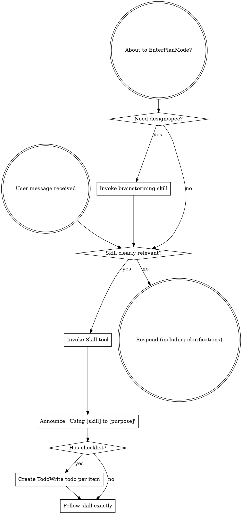

# Using Aegis: Full Skill Discipline

Use this reference when the compact `using-aegis` hot path is not enough to
decide how to trigger skills, order multiple workflows, or adapt tool names for
a host.

## Instruction Priority

Aegis skills override default system prompt behavior, but **user instructions
always take precedence**:

1. **User's explicit instructions** (`CLAUDE.md`, `GEMINI.md`, `AGENTS.md`,
   direct requests) - highest priority
2. **Aegis skills** - override default system behavior where they conflict
3. **Default system prompt** - lowest priority

If a project file says "don't use TDD" and a skill says "always use TDD,"
follow the user's instructions. The user is in control.

## How to Access Skills

**In Claude Code:** Use the `Skill` tool. When you invoke a skill, its content
is loaded and presented to you. Follow it directly.

**In Copilot CLI:** Use the `skill` tool. Skills are auto-discovered from
installed plugins. The `skill` tool works the same as Claude Code's `Skill`
tool.

**In Antigravity CLI / IDE / App:** Prefer portable text requests until the
current Antigravity surface's Skills / plugin contract has been verified. When
Antigravity exposes a native skill or slash-command surface, use that host
mechanism and map Aegis tool names through `references/antigravity-tools.md`.

**In Gemini CLI:** Gemini CLI is a transitional compatibility surface while
Antigravity support matures. Skills activate via the `activate_skill` tool.
Gemini loads skill metadata at session start and activates the full content on
demand.

**In other environments:** Check the platform's documentation for how skills
are loaded.

## Platform Adaptation

Skills use Claude Code tool names. Non-CC platforms: see:

- `references/copilot-tools.md`
- `references/codex-tools.md`
- `references/antigravity-tools.md`
- `references/gemini-tools.md`

## The Rule

Invoke explicitly requested or clearly relevant skills before response or
action. If relevance is uncertain, use the compact hot path to classify first;
load a full skill only when the trigger fits.

## Context Pressure Re-entry

Long sessions, heavy tool output, resume, and context compaction can weaken the
initial startup route. Treat those moments as a re-entry point, not as proof
that Aegis is unavailable.

Before continuing non-trivial work under context pressure, run a compact
re-entry check:

1. What is the current task type?
2. Is an Aegis skill explicitly requested or clearly relevant?
3. Does the task need baseline/plan, debugging, or verification discipline?
4. If yes, load the smallest relevant skill now. If no, continue on the fast
   path and state why.

Do not fix context-pressure misses by broadening every skill description.
First classify the failed trigger-health layer.

## Skill Flow



## Red Flags

These thoughts mean STOP - you're rationalizing:

| Thought | Reality |
|---------|---------|
| "This is just a simple question" | Check routing, but simple Q&A may stay fast path. |
| "I need more context first" | Skill check comes before clarifying questions. |
| "Let me explore the codebase first" | Skills tell you how to explore. Check first. |
| "I can check git/files quickly" | Files lack conversation context. Check for skills. |
| "Let me gather information first" | Skills tell you how to gather information. |
| "This doesn't need a formal skill" | If a skill trigger clearly fits, use it. |
| "I remember this skill" | Skills evolve. Read current version. |
| "This doesn't count as a task" | Action means task. Check for skills. |
| "The skill is overkill" | Classify complexity; load the skill only if the trigger fits. |
| "I'll just do this one thing first" | Check before doing anything. |
| "This feels productive" | Undisciplined action wastes time. Skills prevent this. |
| "I know what that means" | Knowing the concept is not using the skill. Invoke it. |

## Skill Priority

When multiple skills could apply, use this order:

1. **Process skills first** - brainstorming, debugging, planning, review
2. **Implementation skills second** - frontend, MCP, domain-specific build work

Examples:

- "Let's build a new ambiguous feature" -> brainstorming first, then implementation skills
- "Fix this bug" -> debugging first, then domain-specific skills

## Complexity Routing

Before implementation, classify the task:

- **Low complexity:** one local owner, clear behavior, small bug/doc/config
  change. TDD may be the first implementation skill after concise intent,
  authority/baseline check, and verification target.
- **Medium complexity:** multi-file or multi-module work, user-visible
  behavior, routing/state flow, API/contract touch, compatibility boundary, or
  multiple acceptance checks. Create a baseline read-set, plan, and atomic tasks
  before TDD.
- **High complexity:** architecture, data model, permissions, migrations,
  cross-system contracts, long-running work, or ambiguous product behavior. Use
  brainstorming/specification and writing-plans before TDD; get user review
  where the workflow requires it.

TDD is the implementation discipline for approved atomic tasks, not the first
entrypoint for medium- or high-complexity work.

## Project Baseline Bootstrap

In an active project, a project-related question or "what should I do next?"
requires a baseline check before implementation advice.

Baseline candidates:
- project README, CONTRIBUTING, ADRs, architecture docs, and local agent rules
- existing `docs/aegis/baseline/` snapshots
- host-specific project instructions when they define project facts

If no usable baseline exists, do a bounded repo scan before writing one:
- identify project root and git state
- list files with `rg --files` or host equivalent
- skip dependency, generated, build, vendor, and output directories
- read README, manifests, config, entry points, key `src` and test files
- infer stack, module owners, contracts, dependency direction, run/test commands,
  and compatibility boundaries

If sufficient project content exists, create an initial baseline snapshot in
`docs/aegis/baseline/` and then answer the user's original question. If content
is too sparse, do not create an empty baseline; explain the skip and still
answer from available evidence.

## Project Workspace

Hard binary rule:
- Global install (plugin registration, version query, skill listing):
  NEVER write project files.
- Fast path (normal Q&A, simple explanation, version/status checks, tiny docs
  edits, low-risk one-file changes): do not create workspace records.
- Active project records: workspace creation is triggered by baseline bootstrap,
  brainstorming spec output, writing-plans save step, systematic-debugging
  Quality Gate for non-trivial tasks, long-task continuation, or evidence
  trails that need files. When triggered and `docs/aegis/` is missing, create
  it immediately. If it already exists, use it.

Prefer configured Aegis workspace support or installed Aegis workspace support
for initialization, indexing, lifecycle records, proof-bundle assembly, and
structure checks. Helper outputs are method-pack records only, not
authoritative gates.

Aegis workspace helper belongs to the installed method-pack root, not
necessarily the target project. Resolve the helper from `AEGIS_WORKSPACE_HELPER`,
user-local Aegis config, or the installed method-pack root, then pass the target
project separately:

```bash
python <aegis-workspace-helper> check --root <target-project-root>
```

If `check` reports `missing workspace directory: docs/aegis`, treat the target
project as uninitialized rather than treating the method-pack helper as missing.

Workspace Shell:
```
docs/aegis/
├── README.md
├── INDEX.md
├── BASELINE-GOVERNANCE.md
├── adr/
├── baseline/
├── specs/
├── plans/
└── work/
```

Task Work Record:
```
docs/aegis/work/<slug>/
    ├── 10-intent.md
    ├── 20-checkpoint.md
    ├── 90-evidence.md
    └── 99-reflection.md
```

Spec Brief vs Design Spec:
- Spec Brief: `docs/aegis/specs/YYYY-MM-DD-<topic>-brief.md` for medium tasks
  that need what/why/acceptance pinned before planning.
- Design Spec: `docs/aegis/specs/YYYY-MM-DD-<topic>-design.md` for architecture,
  contract, migration, cross-module, or ambiguous product behavior.

Mid-task complexity escalation: pause, init workspace if missing, backfill
required artifacts, then continue.

## Skill Types

**Rigid** skills such as TDD and debugging must be followed exactly.

**Flexible** skills provide patterns that adapt to the current context.

The skill itself tells you which mode applies.

## User Instructions

Instructions say what, not how. "Add X" or "Fix Y" does not mean skip
workflows.
