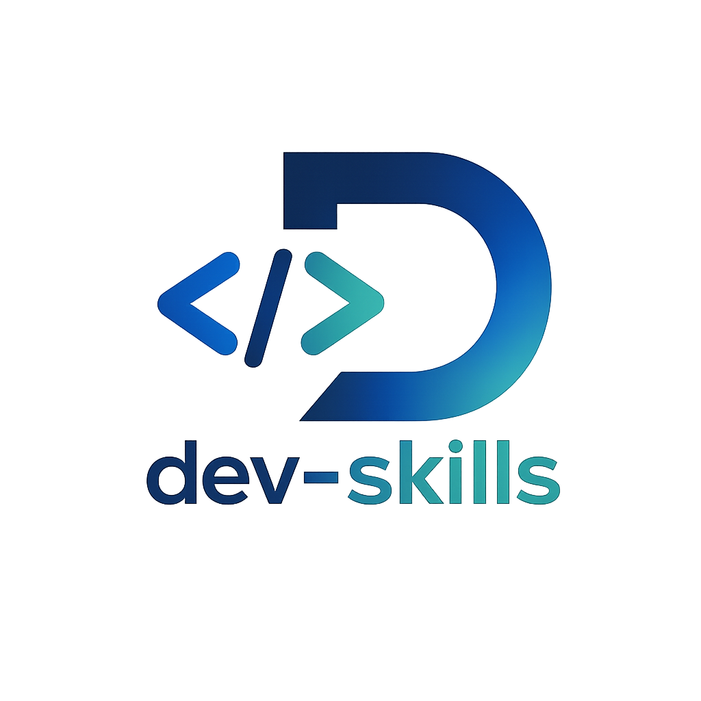
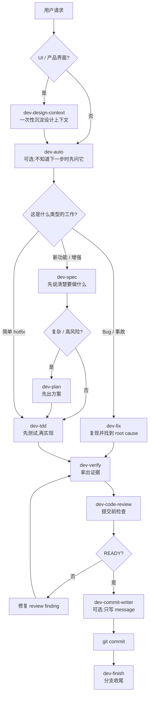

<div align="center">
  
  <p>
    10 个 skill,把 AI 写代码和做界面这件事拆成更稳的步骤。<br/>
    <b>沉淀设计上下文 → 想清楚需求 → 定方案 → 写代码 / 修 bug → 验证 → review → commit → 收尾</b>
  </p>
</div>

<p align="center">
  
  
  
  
</p>

<p align="center">
  <a href="https://jason-chen-coder.github.io/dev-skills/">Website</a>
  ·
  <a href="./docs/onboarding.md">Onboarding</a>
  ·
  <a href="./skills/dev-auto/">Start with dev-auto</a>
</p>

---

## 这是什么

dev-skills 是一套给 Claude Code / Codex 用的开发流程卡片。

你可以把它理解成:每次让 AI 帮你写代码或做界面时,它不用从零猜流程,而是按固定步骤工作。

它主要解决这些问题:

- 需求还没说清楚,AI 就开始写代码。
- 写完只说“已完成”,但没有测试和证据。
- 修 bug 只改了表面现象,没有找到 root cause。
- commit 前没人检查,容易把无关改动、坏测试、临时代码一起提交。

如果你是第一次用,先记住一句话:

> 不知道下一步做什么,就先用 `dev-auto`。它只会推荐下一步,不会替你自动执行其他 skill。

---

## 最常用的三条路

### 1. 做新功能 / 改功能

```text
可选 dev-design-context -> dev-spec -> 可选 dev-plan -> dev-tdd -> dev-verify -> dev-code-review -> git commit -> dev-finish
```

白话解释:

- `dev-design-context`:做 UI、landing page、产品界面前,先把项目设计方向写进 `.design-context.md`;不是设计类工作可以跳过。
- `dev-spec`:先把需求问清楚。
- `dev-plan`:复杂功能先出方案,简单功能可以跳过。
- `dev-tdd`:写生产代码前先写测试,按 red -> green -> refactor 做。
- `dev-verify`:完成前拿出真实命令和测试结果。
- `dev-code-review`:commit 前做一次严格检查。
- `git commit`:确认 READY 后再提交。
- `dev-finish`:最后决定 merge、开 PR、保留分支还是丢弃分支。

### 2. 修 bug / 排查事故

```text
dev-fix -> dev-verify -> dev-code-review -> git commit -> dev-finish
```

白话解释:

- `dev-fix`:先复现 bug,再列假设、找 root cause、写 regression test。
- `dev-verify`:确认修复真的有效。
- `dev-code-review`:检查有没有回归、夹带改动、临时代码。

注意:bug 路径不要再额外接一轮 `dev-tdd`。`dev-fix` 自己已经包含 failing regression test、root-cause fix 和 red -> green -> red。

### 3. 很小的 hotfix

```text
dev-tdd -> dev-verify -> dev-code-review -> git commit
```

白话解释:

- 可以跳过 spec 和 plan。
- 但只要会改行为,仍然建议先用测试锁住这次小改动。
- commit 前还是要验证和 review。

---

## 10 个 skill 怎么记

不需要把 10 个名字都背下来。先记住用户最自然会主动说出口的入口,其他交给流程门禁。

| 类型 | Skill | 什么时候出现 | 它会做什么 |
|---|---|---|
| 用户入口 | [`dev-auto`](./skills/dev-auto/) | 不知道下一步 / 失败后想恢复 | 看当前状态,推荐下一条命令。它不自动调起其他 skill。 |
| 用户入口 | [`dev-spec`](./skills/dev-spec/) | 需求还模糊 | 先问清楚边界,再整理 scope、风险和验收标准。 |
| 用户入口 | [`dev-plan`](./skills/dev-plan/) | 功能复杂 / 风险高 | 把 spec 变成可执行方案,包括选项、取舍和验证方式。 |
| 用户入口 | [`dev-fix`](./skills/dev-fix/) | 修 bug / 排查问题 | 先复现,再找 root cause,最后留下 regression test。 |
| 用户入口 | [`dev-code-review`](./skills/dev-code-review/) | 准备 commit 前 | 从规范、功能、闭环、注释、死代码等角度检查 diff。 |
| 流程门禁 | [`dev-tdd`](./skills/dev-tdd/) | 写生产代码前 | 先写会失败的测试,再写最小实现,最后重构。 |
| 流程门禁 | [`dev-verify`](./skills/dev-verify/) | 声称完成 / fixed / ready 前 | 要求拿出真实命令、测试名和结果,避免口头完成。 |
| 流程门禁 | [`dev-finish`](./skills/dev-finish/) | 验证和 review 通过后 | 帮你决定 merge / PR / keep / discard 等分支收尾动作。 |
| 一次性设置 | [`dev-design-context`](./skills/dev-design-context/) | UI / landing page / 产品界面首次进入项目前 | 扫描项目设计上下文,只问代码里看不出来的问题,把设计原则写到 `.design-context.md`。 |
| 显式旁路 | [`dev-commit-writer`](./skills/dev-commit-writer/) | 明确跳过 review 且只要 commit message | 根据当前 diff 写符合仓库风格的 commit message。 |

简单规则:

- 日常入口只要记住 `dev-auto` / `dev-spec` / `dev-plan` / `dev-fix` / `dev-code-review`。
- 新功能从 `dev-spec` 开始。
- UI / landing page / 产品界面可以先跑一次 `dev-design-context`。
- 修 bug 从 `dev-fix` 开始。
- 不确定就先问 `dev-auto`。
- 准备 commit 前默认跑 `dev-code-review`。
- `dev-tdd` / `dev-verify` / `dev-finish` 更像流程门禁,通常由 agent 在正确阶段提醒。

---

## 安装

Claude Code、Codex、npx skills 的安装方式不一样。选你正在用的工具即可。

### Claude Code

在 Claude Code 里逐行执行:

```bash
/plugin marketplace add https://github.com/Jason-chen-coder/dev-skills
/plugin install dev-skills
```

如果还想让团队规则一直生效,把模板复制到项目根目录:

```bash
curl -O https://raw.githubusercontent.com/Jason-chen-coder/dev-skills/master/CLAUDE.md.template
mv CLAUDE.md.template CLAUDE.md
```

### Codex

本仓库已经包含 `.codex-plugin/plugin.json`。正式上架前,本地兼容方式是把 `skills/*` 复制到 Codex 的 skills 目录:

```bash
git clone https://github.com/Jason-chen-coder/dev-skills.git
cd dev-skills
mkdir -p "${CODEX_HOME:-$HOME/.codex}/skills"
cp -R skills/* "${CODEX_HOME:-$HOME/.codex}/skills/"
```

如果还想让团队规则一直生效,把 Codex 模板复制到项目根目录:

```bash
curl -O https://raw.githubusercontent.com/Jason-chen-coder/dev-skills/master/AGENTS.md.template
mv AGENTS.md.template AGENTS.md
```

### npx skills

```bash
npx skills add Jason-chen-coder/dev-skills              # 安装到当前项目
npx skills add Jason-chen-coder/dev-skills --global     # 安装到全局
```

更完整的安装、兜底方案和升级说明见 [`docs/onboarding.md`](./docs/onboarding.md)。

---

## 升级

### Claude Code

```bash
/plugin update dev-skills
```

如果没生效,卸载后重装:

```bash
/plugin uninstall dev-skills
/plugin install dev-skills
```

### Codex

Codex 当前是复制目录安装,所以升级时需要重新同步:

```bash
cd dev-skills
git pull --ff-only

CODEX_SKILLS_DIR="${CODEX_HOME:-$HOME/.codex}/skills"
mkdir -p "$CODEX_SKILLS_DIR"

for skill in dev-auto dev-spec dev-plan dev-tdd dev-fix dev-verify dev-code-review dev-commit-writer dev-finish dev-design-context; do
  rm -rf "$CODEX_SKILLS_DIR/$skill"
done

cp -R skills/* "$CODEX_SKILLS_DIR/"
```

### npx skills

```bash
npx skills update
```

如果你的版本没有 update,用 force 重新安装:

```bash
npx skills add Jason-chen-coder/dev-skills --force
npx skills add Jason-chen-coder/dev-skills --global --force
```

提醒:升级 skill 不会自动覆盖你项目里的 `CLAUDE.md` / `AGENTS.md`。如果模板更新了,需要你自己对比后同步。

---

## 怎么在对话里用

最常用的说法是这些:

```text
用 dev-auto 看看下一步该做什么
用 dev-spec 帮我梳理这个需求: ...
用 dev-plan 基于这个 spec 出实施方案
用 dev-fix 排查这个 bug: ...
用 dev-code-review 看下这次修改,准备 commit
我自审过了,只要 dev-commit-writer 给 commit message
```

设计类项目第一次进入时,可以加一句:

```text
用 dev-design-context 先沉淀这个项目的设计上下文
```

`dev-tdd` / `dev-verify` / `dev-finish` 一般不用刻意记。它们是流程门禁:写代码前、声称完成前、分支收尾时由 agent 提醒。你也可以在需要手动控制时直接说:

```text
用 dev-tdd 实现这个功能
用 dev-verify 检查这次改动是否真的完成
用 dev-finish 收尾这个分支
```

如果你的工具支持 slash 命令,常用入口和显式旁路是:

```text
/dev-auto
/dev-spec
/dev-plan
/dev-fix
/dev-code-review
/dev-commit-writer
```

---

## 规则从哪里来

这个仓库有三层规则。

### 1. 基线规则

[`references/dev-baseline.md`](./references/dev-baseline.md) 是所有 skill 都会加载的基础规则。

它只有四个核心原则:

- 不要乱猜。
- 代码尽量少。
- 只改这次必须改的地方。
- 完成标准必须能验证。

想知道为什么定这些规则,看 [`docs/why-dev-baseline.md`](./docs/why-dev-baseline.md)。

### 2. 常驻团队规则

[`CLAUDE.md.template`](./CLAUDE.md.template) 和 [`AGENTS.md.template`](./AGENTS.md.template) 是短版 always-on 规则。

复制到项目根目录后,AI 每次工作都会读到这些规则。

### 3. 详细团队政策

[`docs/team-policy.md`](./docs/team-policy.md) 放更细的团队治理内容,例如分支、PR、测试、错误处理、日志、feature flag 等。

---

## 工作流图



---

## 你可能会问

<details>
<summary><b>这些 skill 会互相自动调用吗?</b></summary>

不会。

`dev-auto` 只推荐下一步,不自动调起其他 skill。其他 skill 也都只做自己的事。这样做是为了让每一步都可控、可复核。

</details>

<details>
<summary><b>哪些 skill 会生成文件?</b></summary>

| Skill | Artifact |
|---|---|
| `dev-design-context` | `.design-context.md` |
| `dev-spec` | `.claude/artifacts/designs/<feature>.md` |
| `dev-plan` | `.claude/artifacts/plans/<feature>.md` |
| `dev-fix` | `.claude/artifacts/fixes/<slug>.md` |
| `dev-auto` / `dev-tdd` / `dev-verify` / `dev-code-review` / `dev-commit-writer` / `dev-finish` | 不生成 artifact,只输出到 chat |

`dev-code-review` 和 `dev-commit-writer` 可以读取这些 artifact,并在 commit message 里自动补 `Refs: <type>/<slug>`。

</details>

<details>
<summary><b>我只是改一行,也要跑完整流程吗?</b></summary>

不用。

一句话 hotfix 可以跳过 `dev-spec` 和 `dev-plan`,但只要改的是行为,仍建议走:

```text
dev-tdd -> dev-verify -> dev-code-review -> git commit
```

</details>

<details>
<summary><b>什么时候用 dev-code-review,什么时候用 dev-commit-writer?</b></summary>

准备 commit 前,默认用 `dev-code-review`。

只有你已经自审过、明确只想要 commit message 时,才用 `dev-commit-writer`。

</details>

---

## 版本历史

详见 [`CHANGELOG.md`](./CHANGELOG.md)。

---

<p align="center">
  <sub>
    MIT License · <a href="./CHANGELOG.md">CHANGELOG</a> · <a href="./CONTRIBUTING.md">Contributing</a> · <a href="https://github.com/Jason-chen-coder/dev-skills/issues">Issues</a>
  </sub>
</p>

<p align="center">
  <sub>灵感来自 <a href="https://github.com/forrestchang/andrej-karpathy-skills">karpathy-skills</a> · <a href="https://github.com/yeachan-heo/oh-my-claudecode">oh-my-claudecode</a></sub>
</p>
