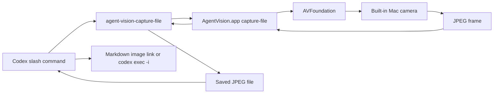

# Agent Vision

Agent Vision is a macOS-only Codex plugin that lets a local Codex session capture camera frames through a signed local app and materialize them as JPEG files.

It gives Codex a tiny, explicit window into the physical world around your Mac. Not a browser camera hack. Not a cloud vision service. Not an always-on surveillance product wearing a fake mustache and pretending to be productivity software. Just a signed native macOS app and a local JPEG file when you ask for one.

Some people will love this. Some people will absolutely hate it. Both reactions are reasonable.

If the idea of an AI assistant seeing your desk makes your soul leave your body and file a formal complaint, this plugin is not trying to convert you. Agent Vision is for the person who already trusts a local Codex session with real work and wants to say, "look at this thing," without taking a screenshot, emailing themself a photo, dragging files around, or performing the tiny office ritual where you hold a circuit board up to a laptop camera like you are negotiating with the future.

## What It Does

Version 1.0.3 gives Codex an explicit one-shot file capture path. Installing the plugin, enabling the plugin, opening Codex, or sending unrelated prompts must not start `agent-vision-mcp`, `AgentVision.app`, or any Agent Vision camera-capable helper process.

The user-facing slash command is intentionally small:

```text
/agent-vision snapshot
/agent-vision streaming
/agent-vision roast
/agent-vision mood
```

Snapshot mode starts the camera if needed, waits for a usable JPEG frame, materializes that frame under `~/.codex/agent-vision/frames`, displays it with an absolute Markdown image link, and stops the camera only if snapshot started it. If the camera returns a black warm-up frame, Agent Vision keeps the camera on, waits 5 seconds between attempts, and tries up to 3 total attempts.

Streaming mode is temporarily disabled in 1.0.3 while the runtime is being moved to an explicit start/stop design that does not depend on plugin-load MCP server lifecycle.

Roast mode is snapshot plus prose: it materializes a usable JPEG frame, passes that exact file to `codex exec -i`, and returns one opt-in playful roast of 400 characters or fewer.

Mood mode is snapshot plus delivery calibration: it materializes a usable JPEG frame, passes that exact file to `codex exec -i`, parses strict JSON with `presence`, `interaction_state`, `confidence`, `observable_basis`, and `assistant_adjustments`, and applies that result internally. The normal user experience shows neither the captured image nor the raw JSON. The result shapes only the current response or task phase: pacing, verbosity, clarification threshold, evidence density, tone, and repair behavior. It does not change facts, permissions, approval behavior, user intent, or task scope.

If you ask for streaming, Agent Vision reports the temporary disabled state and launches no Agent Vision process:

```text
Agent Vision streaming is temporarily disabled in 1.0.3 while the runtime is being moved to an explicit start/stop design.
```

Stop-streaming requests also launch no Agent Vision process because there is no streaming session to stop in 1.0.3.

## What It Does Not Do

Agent Vision does not implement:

- Cloud upload.
- Background recording.
- Audio capture.
- Device selection.
- Browser `getUserMedia`.
- Remote camera access.
- Automatic frame ingestion.
- Mood history, training datasets, background mood detection, or a separate image archive.

The camera stays local. Snapshot, roast, and mood mode use a saved JPEG file as the user-visible image contract.

## Who This Is For

Agent Vision is for local-first Codex users who want the assistant to inspect physical things near the computer.

It is useful when the thing you need help with is real, visible, and annoying to describe:

- A handwritten note that says either `token` or `toker`, and unfortunately the distinction matters.
- A breadboard where one jumper wire is doing interpretive dance.
- A router light pattern that appears to be communicating in passive aggression.
- A whiteboard diagram that made sense during the meeting and has since become a corporate cave painting.
- A printed error code on a device whose manufacturer believed fonts were a moral weakness.
- A desk setup where the cable situation has entered its final form.
- A receipt, shipping label, part number, serial number, or sticker that you do not want to retype.
- A physical prototype where you need another set of eyes and those eyes can also read Swift.

It is not for people who want their camera to be completely absent from their AI workflow. That is a good boundary. Keep it. This plugin is deliberately explicit because the camera is not a casual permission.

## Install

Ask Codex to install Agent Vision from the repository URL:

```text
Install Agent Vision from https://github.com/zfifteen/agent-vision
```

Codex should download the packaged release from that repository, extract it, run the package `install.sh`, and then open a new Codex session so `/agent-vision` is loaded.

For QA evidence that the install and uninstall lifecycle maps to the available OpenAI/Codex plugin guidance, see [docs/agent-vision-install-uninstall-traceability.md](docs/agent-vision-install-uninstall-traceability.md).

Manual package install:

```bash
curl -L -o agent-vision-1.0.3.tar.gz https://github.com/zfifteen/agent-vision/releases/download/v1.0.3/agent-vision-1.0.3.tar.gz
tar -xzf agent-vision-1.0.3.tar.gz
cd agent-vision-1.0.3
./install.sh
```

## Prompt Codex To Install This

If you are asking Codex to install the plugin for you, use a prompt like this:

```text
Install Agent Vision from https://github.com/zfifteen/agent-vision. Use the packaged release archive from the repo releases, not the source/developer installer. Extract the archive, run ./install.sh, and open a new Codex session before using /agent-vision. Confirm install and idle Codex startup create no Agent Vision process.
```

## Slash Commands

Ask Codex:

```text
Use Agent Vision to start the camera, inspect the latest frame, and tell me what you can read from my note.
```

Take one image and turn the camera off:

```text
/agent-vision snapshot
```

Use this when you want one usable image and then want the camera off. Codex should show the saved JPEG through an absolute Markdown image link.

Streaming mode is temporarily disabled:

```text
/agent-vision streaming
```

This launches no Agent Vision process in 1.0.3. The command returns the temporary disabled message.

Stop streaming:

```text
Agent Vision streaming off
```

You can also say `stop streaming` or `turn off the camera`. In 1.0.3, Codex reports that there is no Agent Vision streaming session to stop and launches no Agent Vision process.

Take one image and request immediate emotional damage, responsibly:

```text
/agent-vision roast
```

Roast mode uses the same camera lifecycle as snapshot mode, then adds a short text response. The roast is opt-in and based only on visible non-sensitive details such as outfit, posture, expression, lighting, or room chaos. It should not infer or attack protected traits, body size, age, disability, or other sensitive attributes. It is a tiny comedy mode, not a license to become a municipal cruelty department.

## Example Workflows

Read something in the room:

```text
/agent-vision snapshot

What does the label on this device say?
```

Debug a physical setup:

```text
/agent-vision snapshot

Compare this prototype state to the expected wiring and tell me what looks wrong.
```

Use it as the least glamorous lab assistant ever hired:

```text
/agent-vision snapshot

Is this connector seated correctly, or am I about to spend 45 minutes blaming software for a cable problem?
```

Use it for desk archaeology:

```text
/agent-vision snapshot

Find the sticky note with the part number and read it back to me.
```

Use it for gentle accountability:

```text
/agent-vision snapshot

Does my whiteboard plan contain an actual architecture, or did I draw six boxes and hope confidence would do the rest?
```

Use it when you have made the bold choice to ask your computer for fashion notes:

```text
/agent-vision roast

Roast me in 400 characters or fewer.
```

The plugin cannot touch objects, move the camera, choose a different camera, or infer anything outside the returned image. If the camera cannot see it, Agent Vision cannot see it either. This is still software, not a dramatic scene from a hacking movie.

Estimate current interaction state for response delivery:

```text
/agent-vision mood
```

Mood mode is opt-in. It uses the same saved JPEG frame path as snapshot and roast, then asks a separate image-input Codex pass for strict JSON. The captured image and JSON are internal control signals and are not displayed in the normal response. Low-confidence or unusable images return `uncertain` or `absent` and do not apply state-specific response shaping. User correction overrides the visual estimate for the current response or task phase.

## Architecture



The plugin package contains:

- `.codex-plugin/plugin.json`
- `.mcp.json`
- `commands/agent-vision.md`
- `skills/camera-control/SKILL.md`
- `dist/AgentVision.app`
- `dist/agent-vision-capture-file`

The native app owns the camera permission. The file materializer launches the signed app bundle only for explicit one-shot capture, writes exactly one JPEG image to an explicit absolute path, and prints JSON. This preserves the macOS app identity that Camera permission is attached to while giving Codex an inspectable local file.

The installer stages the plugin under `~/plugins/agent-vision`, caches it under `~/.codex/plugins/cache/local/agent-vision/1.0.3`, registers the home-local marketplace and `agent-vision@local` plugin entry in `~/.codex/config.toml`, removes legacy duplicate `mcp_servers.agent_vision` and `mcp_servers."agent-vision"` config, verifies that no Agent Vision MCP wrapper is installed, and runs a Codex admission check before exiting.

## Camera Modes

Snapshot mode:

1. Codex runs `agent-vision-capture-file --output "$OUTPUT" --json`.
2. The file materializer launches `AgentVision.app capture-file`.
3. `AgentVision.app` starts the built-in camera if it is not already running.
4. The app waits for and returns one usable JPEG frame.
5. The file materializer writes the JPEG to `$OUTPUT` and prints JSON with `ok: true`.
6. Codex displays the saved JPEG with an absolute Markdown image link.

Roast mode:

1. Codex runs `agent-vision-capture-file --output "$OUTPUT" --json`.
2. The file materializer writes one usable JPEG to `$OUTPUT`.
3. Codex runs `codex exec --ephemeral --skip-git-repo-check -i "$OUTPUT" -- "...roast prompt..."`.
4. Codex returns the saved JPEG link and the roast text from that image-input pass.

Mood mode:

1. Codex runs `agent-vision-capture-file --output "$OUTPUT" --json`.
2. The file materializer writes one usable JPEG to `$OUTPUT`.
3. Codex runs `codex exec --ephemeral --skip-git-repo-check -i "$OUTPUT" -- "...mood JSON prompt..."`.
4. Codex parses the strict JSON from that image-input pass.
5. Codex applies permitted response-shape adjustments only to the current response or task phase.
6. Codex does not display the captured image, raw JSON, confidence band, or visual-analysis rationale unless the user explicitly asks to debug mood mode.

Streaming mode is disabled in 1.0.3. `/agent-vision streaming`, `stop streaming`, and `turn off the camera` launch no Agent Vision process.

The user-visible invariant is simple: snapshot, roast, and mood blink the camera on briefly; install, idle Codex startup, unrelated prompts, streaming requests, and stop-streaming requests create no Agent Vision process.

## Privacy

Agent Vision is explicit and one-shot in 1.0.3. Snapshot, roast, and mood mode start the camera only for one frame. There is no installed Agent Vision MCP server and no streaming session.

macOS asks for camera permission for the signed `AgentVision.app` the first time the capture session starts. Repeated prompts usually mean the app identity changed and the local installer should be rerun.

Version 1.0.3 does not implement background recording, cloud upload, device selection, audio capture, unsolicited streaming into Codex context, streaming mode, mood history, training datasets, or a separate mood image archive.

See [PRIVACY.md](PRIVACY.md) for the standalone policy.

## Development

Run the test suite:

```bash
swift test
```

Build the release executable:

```bash
swift build -c release
```

Validate manifests and release build without installing:

```bash
scripts/install-local.sh --dry-run
```

Run the slash-command matrix:

```bash
scripts/test-slash-commands.sh
```

Build a release archive:

```bash
AGENT_VISION_SIGN_IDENTITY="Developer ID Application: Your Name (TEAMID)" \
scripts/package-release.sh
```

Uninstall the local plugin:

```bash
scripts/uninstall-local.sh
```

The source installer is for development and release production. It builds and signs `AgentVision.app` locally, so it requires Swift, Xcode command line tools, and a local signing identity. The default install path for users is the packaged release installer.

## Troubleshooting

If the slash command does not appear, verify the local plugin cache exists:

```bash
ls ~/.codex/plugins/cache/local/agent-vision/1.0.3
```

If macOS repeatedly asks for camera permission, rerun the installer. Camera permission is tied to the signed `AgentVision.app` identity.

If streaming is requested, Agent Vision 1.0.3 reports that streaming is temporarily disabled and launches no process.

If snapshot or roast mode sees a black frame, it treats that as camera warm-up and keeps the camera on. The 5-second wait happens between attempts, for 3 total attempts. After 3 black-frame attempts, it returns an error instead of handing Codex a useless image.

## License

MIT
